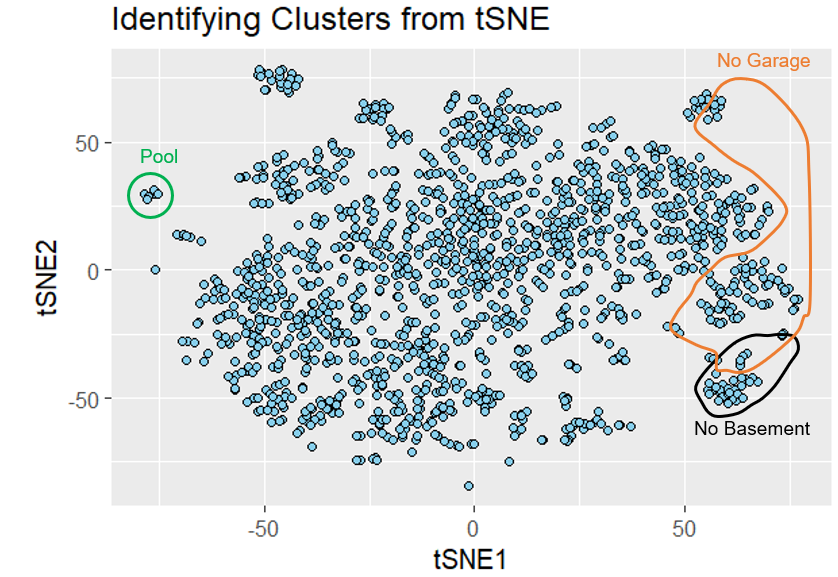

# BIOS 635 Final

Ames, Iowa---known for pioneering electronic digital computing, hosting the first animal gene bank in the US, and being the college town of Iowa State University---is also the subject of Kaggle's second-most popular ongoing competition [[1](https://facts.net/world/cities/10-facts-about-historic-events-and-moments-in-ames-iowa/),[2](https://www.kaggle.com/competitions/house-prices-advanced-regression-techniques)]. Titled "House Prices -- Advanced Regression Techniques", this competition challenges participants to hone their regression skills in predicting the sale prices for 1,459 Ames homes using a variety of predictor types [[2](https://www.kaggle.com/competitions/house-prices-advanced-regression-techniques)]. The most competitive submissions focus on minimizing the modified root-mean-squared error defined below:

$\sqrt{\frac{1}{n} \sum_{i=1}^n (\log(\hat{y}_i) - \log(y_i))^2}$

$n$: test set size

$\hat{y}_i$: predicted sale price for $i$th house

$y_i$: true sale price for $i$th house

Submissions approaching 0 error showcase the latest approaches for competitive marketplace research, while other methods trade some performance for interpretability, helping real estate stakeholders come to a consensus on the leading determinants of home value [[3](https://ieeexplore.ieee.org/abstract/document/8392275)]. While public health is certainly related to this subject matter, it is not the first aspect that comes to mind. I was instead drawn to this project for its data makeup, which is restricted to numeric and categorical data. Without the complexity overhead of time-series, image, or text data, I was able to get the most out of the methods discussed in this class.

To understand how these data influenced the direction of this project, consider its characteristics below:

-   [Structure]{.underline}: one observation per subject

-   [Training Observations (Complete Cases)]{.underline}: 1,460 (1,095)

-   [Missing Data Prevalence in Raw Data]{.underline}:

    -   365/1,460 (25.0%) rows with missing data

    -   6,965/118,260 (5.9%) cells with missing data

-   [Input Feature Types]{.underline}:19 continuous, 14 discrete, 21 ordinal, 25 nominal

-   [Continuous Input Feature Distributions]{.underline}: 9 normal, 20 right-skewed, 1 left-skewed, 2 bimodal, 1 uniform

-   [Response Distribution]{.underline}: right-skewed, no missing,

    -   min \$34,900

    -   Q1 \$129,975

    -   median \$163,000

    -   Q3 \$214,000

    -   max \$755,000

Compared to my previous project, the following report will detail a more sophisticated data processing approach, which inspired a new detour into unsupervised learning, in addition to the core supervised learning used for competition submissions [[4](https://github.com/medwar747/635_Machine_Learning_Midterm)]. While a light gradient-boosting machine (LightGBM) once again proved to be the most accurate, it did not eclipse the utility of models like lasso and ridge regression in revealing feature importance. All analyses were conducted using R version 4.3.0.

## Data Processing

Project data was conveniently prearranged into the column structure compatible with statistical software, but was not ready for model building without some modifications.

##### Not Applicable

One of my first observations was that a handful of data features---Basement Condition, Garage Quality, etc.---had a significant level of missingness. It is understandable that not every house has a basement or a garage, but I disagree with labeling these values as missing. Since I intended to impute all missing values, I did not, for example, want a home without a basement to later be assigned a basement ceiling height of 80-89 inches. Perhaps this scenario would not have been an issue from a model performance perspective, but I wanted to preserve the distinction between houses without basements, garages, etc. for my unsupervised learning analysis. Thus, I introduced an "NA" category whenever possible. This adjusted the missingness prevalence to 365/1,460 (25.0%) rows with missing data and 395/118,260 (0.3%) cells with missing data.

##### Standardization

To ensure balanced features, model efficiency, and computational stability, I reduced location and scale disparities between all numeric input features by standardizing them to have mean 0 and standard deviation 1 [[5](https://builtin.com/data-science/when-and-why-standardize-your-data)].

##### Missing Data

The difference in the above measurements of missingness tells us that missingness is not significantly determined by specific observations, so complete case analysis is not viable for a competitive submission. I instead used the `mice::mice function` with `method=“rf”` to implement random forest Multiple Imputation by Chained Equations (MICE) to handle missingness across all variable types at once [[6](https://www.rdocumentation.org/packages/mice/versions/3.16.0/topics/mice)].

##### Collinearity

Variables are collinear if they are highly correlated and thus approximate a linear combination relationship [[7](https://towardsdatascience.com/a-beginners-guide-to-collinearity-what-it-is-and-how-it-affects-our-regression-model-d442b421ff95)]. Collinearity can accumulate in data with a large number of predictors and put stress on model accuracy and reliability [[7](https://towardsdatascience.com/a-beginners-guide-to-collinearity-what-it-is-and-how-it-affects-our-regression-model-d442b421ff95)].

Despite the data having 79 features, 277 predictors are used to properly encode ordinal and nominal data---a recipe for collinearity. Additionally, the many features have intuitive associations, such as between the square footage of the first floor and the square footage of the second floor, or between the flatness of the property and the slope of the property. I thus conducted eigenanalysis on the predictor space to quantify and locate collinearity. Of the 277 principal components of this predictor space, the first 85 account for over 99% of the variance in the data, confirming the presence of collinearity. The first principal component suggests that the year a house was built, the year its garage was built, and the year it was remodeled are the most prominently related. This is evident below:

Although I could have continued to identify a number of collinear predictors, the supervised models used in this project mostly address collinearity automatically. However, since I have already identified the cases above, I elected to remove GarageYrBlt and YearRemodAdd from my models.

## Unsupervised Learning

As I noted from data cleaning, there are many descriptors for amenities that are simply not applicable to every property. These amenities include alleyways, basements, fireplaces, garages, pools, and fences. Intuitively, one would expect these amenities to have substantial influence on the sale price and other features of a home, such that homes with similar amenity indicators would be more similar overall. Thus, I used unsupervised learning methods to detect and visualize such amenity-driven similarities in the data.

First, I experimented with the four different dimension reduction methods used in class to display the 277-dimensional data with just 2 dimensions, and labeled any clusters that accurately and exhaustively delineated the presence or absence of an amenity. The methods were Principal Component Analysis (PCA) using default prcomp, Kernel PCA using default `kernlab::kpca`, t-Distributed Stochastic Neighbor Embedding (tSNE) using default `tsne::tsne`, and Uniform Manifold Approximation and Projection (UMAP) using default `umap::umap`, with results below.

It appears that the more complex tSNE and UMAP projections do in fact have some utility in identifying key amenities, although the true regions encircled above do not form the most intuitive clusters. We can see to what extent clustering algorithms prioritize these regions by first defining the five mutually exclusive amenity statuses we observed above:

I considered three clustering algorithms known for their use on high-dimensional data and applied them to each dimension reduction method used above. As introduced in class, K-means is an intuitive, distance-based clustering algorithm, that happens to benefit from data being scaled as I have done [[8](https://towardsdatascience.com/a-practical-guide-on-k-means-clustering-ca3bef3c853d)]. K-means using `kmeans(centers=5, nstart=20)` performed understandably badly on the two types of PCA projections because the projections do not have five locally distinct regions [[8](https://towardsdatascience.com/a-practical-guide-on-k-means-clustering-ca3bef3c853d)]. Next, I tried DBSCAN, which instead clusters by density [[9](%5Bhttps://scikit-learn.org/stable/modules/generated/sklearn.cluster.DBSCAN.html%5D(https://scikit-learn.org/stable/modules/generated/sklearn.cluster.DBSCAN.html)%7B.uri%7D)]. DBSCAN is also unique because the number of clusters can only indirectly be specified by adjusting a tuning parameter, `eps` [[9](%5Bhttps://scikit-learn.org/stable/modules/generated/sklearn.cluster.DBSCAN.html%5D(https://scikit-learn.org/stable/modules/generated/sklearn.cluster.DBSCAN.html)%7B.uri%7D)]. DBSCAN using `fpc::dbscan` supplied only weak improvement over K-means, suggesting that the true optimal number of clusters is different from five as I insisted by 'hacking' the tuning parameter for each projection. The third method, spectral clustering, ultimately stands out as most effective, especially for the tSNE projection (see below). Spectral clustering is known for being able to handle nested or nonconvex clusters, but the simple, globular predictions yielded from implementing it as `kernlab::specc(centers=5)` lead me to believe its success was merely by chance [[10](https://scikit-learn.org/stable/modules/generated/sklearn.cluster.SpectralClustering.html)].

I used the Normalized Mutual Information (NMI), `aricode::NMI`, to quantify how well the predicted clusters matched the true clusters. A value of 1 indicates identical assignment, while a value of 0 indicates no mutual information between assignments [[11](https://www.mathworks.com/matlabcentral/fileexchange/130784-normalized-mutual-information-nmi-for-cluster-analysis)]. Although the highest NMI is already quite low at 0.328, all other contenders scored below 0.074. It is evident that my combination of dimension reduction and clustering is not a reliable strategy for identifying amenities; however, this exercise has confirmed that the absence of key amenities like basements and garages has an identifiable influence on the features of the dataset.

## Supervised Learning

I would not be satisfied to simply adapt to this scenario the unstoppable LightGBM without first gleaning a few final insights from this rich dataset.

##### Ridge and Lasso Regression

The shrinkage term that characterizes ridge and lasso regression incorporates feature importance into the model in a way that addresses collinearity while retaining the interpretability of linear regression [[12](https://www.publichealth.columbia.edu/research/population-health-methods/ridge-regression)]. In both ridge and lasso regression, the tuning parameter, $\lambda$, determines how low to shrink the coefficients of low-utility predictors. While ridge regression coefficients do not completely reduce to zero, lasso regression coefficients do reach zero, leading to streamlined interpretations as will follow.

Both models were trained with `glmnet::glmnet` and optimized via 5-fold cross validation over $\lambda$. Ridge regression with $\lambda$=93260.33 scored 0.16217 (34.6th percentile), and lasso regression with $\lambda$=3162.278 scored an improved 0.15213 (41.0th percentile). Note the predictors most resistant to shrinkage via lasso regression in the profile below.

Note that the optimal model is at $\log(\lambda)$=8.1, where only 29 of the original 288 parameters are retained with nonzero coefficients. Note how the top 9 predictors demonstrate how the different variable types are encoded for model compatibility: numeric variables are unchanged, categorical variables are made into indicator variables for each category ("Presence of ..."), and ordinal variables are made into unique contrast combinations of their levels.

##### LightGBM

In my previous project, LightGBM was implemented by user kailex with `lightgbm::lgb.train` to win the competition [[4](https://github.com/medwar747/635_Machine_Learning_Midterm)]. That model was already tuned when I commandeered it, I simply added my imputation approach to data preprocessing. In order to use LightGBM again for this competition, I needed to switch the objective from binary classification to regression, and implement the new evaluation metric (root mean squared error of log-adjusted values). I also removed the downsampling process from the code since there were no longer lopsided response categories to balance.

Even though kailex's model was not optimized for this data, it still performed better than LightGBM with default settings [[13](https://lightgbm.readthedocs.io/en/latest/Parameters.html)]. I used these differences to inform a final attempt. Since computing power never proved to be a significant barrier, I retained kailex's computationally ambitious learning rate, number of boosting iterations, and improvement tolerance [[14](https://www.machinelearningexpedition.com/lightgbm-hyperparameter-tuning/)]. Other parameter choices, like kailex's reduced number of leaves, feature fraction, and bagging fraction were selected to prevent overfitting, but it is hard to know for our data where the cutoff for overfitting (and underfitting) is [[14](https://www.machinelearningexpedition.com/lightgbm-hyperparameter-tuning/)]. Continuing to set the feature fraction equal to the bagging fraction, I performed a modest grid search for combinations of leaves (5, 15, 25) and proportions (0.5, 0.6, 0.7). Note the differences between the three key attempts below:

Compared to the final model, it is likely that the model with default settings overfits because it is distributed across a smaller number ($<<$ boosting iterations) of larger trees ($>>$ number of leaves) that themselves overfit the data. For kailex's model, it is not so clear, as the decrease in the number of leaves is seemingly at odds with the increase in the feature/bagging fraction; however, the difference in performance is marginal.

##### Conclusion

LightGBM consistently outperformed ridge and lasso regression in this competition, but its performance range is much broader due to the number of tunable parameters involved. Even with informed tuning, it was difficult to approach the leaderboard's top scores. This project also demonstrated that the predictive power of a model is not its only desirable attribute. Methods with moderate-to-poor observation-level predictability, like the regression family of models or unsupervised clustering algorithms revealed important relationships between features. Namely, we confirmed that garage and basement features are prominently features in this dataset and are crucial determinants of the sale price of a home.

Given another opportunity, I would be interested in comparing the performance of LightGBM to the popular XGBOOST, which instead grows trees depth-wise [[15](https://towardsdatascience.com/lightgbm-vs-xgboost-which-algorithm-win-the-race-1ff7dd4917d)]. I would also try to explain the observed clusters formed by the fascinating Kernel PCA and UMAP projections. In the meantime, A complete repository of project files can be found on my GitHub page [[16](https://github.com/medwar747/635_Machine_Learning_Final)].
